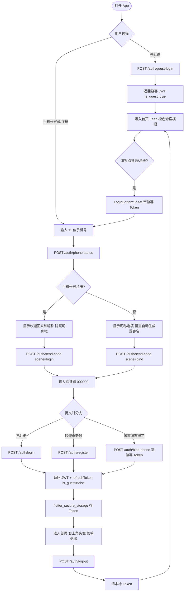
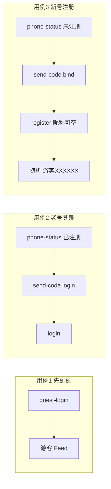
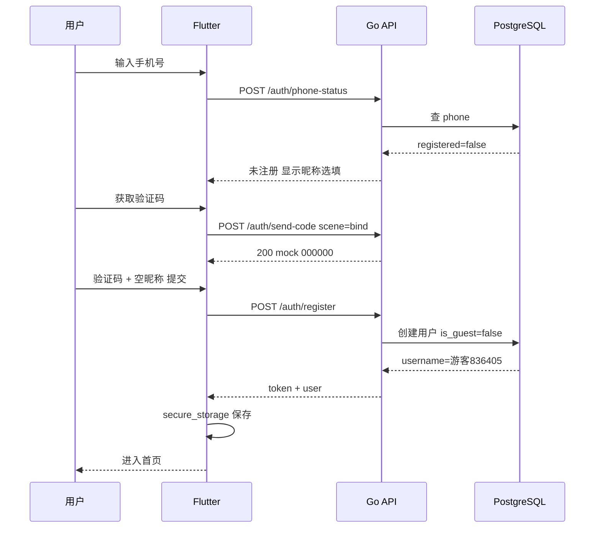

# MATCHit 注册 / 登录流程

> 开发验证码：`000000`（`SMS_MOCK=true`）  
> 在线预览 Mermaid：复制下方代码块到 https://mermaid.live

---

## 1. 总览流程图



---

## 2. 三条测试用例



---

## 3. 时序图（欢迎页注册）



---

## 4. API 清单

| API | 方法 | 鉴权 | 作用 |
|-----|------|------|------|
| `/api/v1/auth/guest-login` | POST | 无 | 按 device_id 创建/查找游客 |
| `/api/v1/auth/phone-status` | POST | 无 | 查手机号是否已注册，返回 username |
| `/api/v1/auth/send-code` | POST | 无 | 发验证码 scene=bind 或 login |
| `/api/v1/auth/register` | POST | 无 | 欢迎页新手机号注册，昵称可空 |
| `/api/v1/auth/login` | POST | 无 | 已注册手机号登录 |
| `/api/v1/auth/bind-phone` | POST | 游客 JWT | 游客绑手机升级；已注册号则直接登录 |
| `/api/v1/auth/refresh` | POST | 无 | refresh_token 续期 |
| `/api/v1/auth/logout` | POST | 任意 JWT | 退出，吊销 token |
| `/api/v1/me` | GET | 任意 JWT | 当前用户信息 |

---

## 5. 前端分支逻辑（PhoneAuthForm）

| 条件 | 调用 API |
|------|----------|
| phone-status → 已注册 | `login` |
| 欢迎页 + 未注册 | `register` |
| 游客弹窗 + 未注册 | `bind-phone`（需游客 Token） |
| 先逛逛 | `guest-login` |

---

## 6. UI 状态

| 状态 | is_guest | 首页表现 |
|------|----------|----------|
| 游客 | true | 橙色「游客模式」+ 登录/注册 |
| 已登录 | false | 右上角头像，菜单退出 |

---

## 7. 如何导出为图片

1. 打开 https://mermaid.live  
2. 复制上面任意 ` ```mermaid ` 代码块内容粘贴  
3. 右上角 **Actions → PNG / SVG** 下载  

或在 Cursor 里打开本文件，安装 Mermaid 预览插件后导出。
